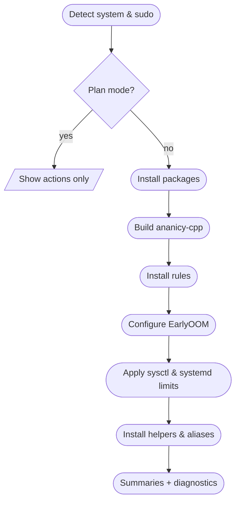
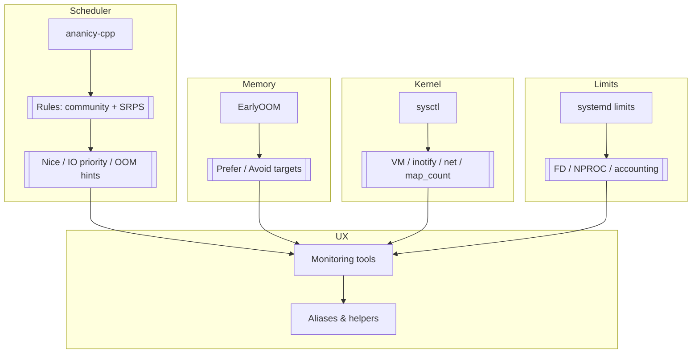

<div align="center">

# 🛡️ System Resource Protection Script (SRPS)

**Make it *hard* for runaway dev processes and heavy desktop apps to freeze your Linux box (or WSL2 instance), while keeping interactive workloads snappy.**

[](https://www.debian.org/)
[](https://docs.microsoft.com/en-us/windows/wsl/)
[](#-quickstart)
[](#-requirements)
[](LICENSE)

---

</div>

## 🎯 What It Does

This repo contains a **single, self-contained shell script** that intelligently wires together:

- 🔧 **[`ananicy-cpp`](https://gitlab.com/ananicy-cpp/ananicy-cpp)** — Auto-nicer with curated rules for compilers, browsers, IDEs, language servers, containers, etc.
- ⚡ **[`earlyoom`](https://github.com/rfjakob/earlyoom)** — OOM killer tuned for developer workflows, preferring to kill obvious hogs instead of your WM/terminal
- ⚙️ **Kernel (`sysctl`) tweaks** — Biased towards interactivity and IDEs
- 🔒 **WSL2 / systemd manager limits** — Prevents pathological file descriptor / process explosions
- 📊 **Monitoring tools & aliases** — Visibility and manual control helpers

> ✨ **Designed to be safe to run repeatedly, and fully reversible via `--uninstall`**



---

## 🚀 Quickstart

### 📥 Install (or Update)

Recommended (with integrity check):

```bash
curl -fsSL https://raw.githubusercontent.com/Dicklesworthstone/system_resource_protection_script/main/verify.sh -o verify.sh
bash verify.sh latest          # downloads release install.sh + checksum and verifies
bash install.sh --plan         # preview
bash install.sh                # apply
```

Quick (no verification):

```bash
curl -fsSL https://raw.githubusercontent.com/Dicklesworthstone/system_resource_protection_script/main/install.sh | bash
```

#### What Happens During Install

The script performs **6 steps**:

1. **🔨 Build & Install** `ananicy-cpp` from source (if not already present)
2. **📋 Configure Rules** — Replaces/augments Ananicy rules with:
   - CachyOS community rules (best-effort fetch)
   - SRPS-specific ruleset targeting heavy dev/desktop workloads
3. **⚡ Setup EarlyOOM** — Installs and configures with dev-friendly defaults
4. **⚙️ Apply Kernel Tweaks** — `sysctl` optimizations for responsiveness and IDEs
5. **🔒 Set Systemd Limits** — Manager limits (especially useful on WSL2)
6. **📊 Install Tools** — Monitoring utilities and shell aliases

> 💡 **Re-running the same command is idempotent** — it updates configs in-place and keeps backups of anything it overwrites.

---

### 🗑️ Uninstall

To undo SRPS configuration and restore backups where possible:

```bash
curl -fsSL https://raw.githubusercontent.com/Dicklesworthstone/system_resource_protection_script/main/install.sh | bash -s -- --uninstall
```

**Non-interactive uninstall:**

```bash
curl -fsSL https://raw.githubusercontent.com/Dicklesworthstone/system_resource_protection_script/main/install.sh | bash -s -- --uninstall --yes
```

---

## 📦 Alternative Install Methods

### Homebrew (Linuxbrew/macOS)

```bash
brew tap Dicklesworthstone/system_resource_protection_script https://github.com/Dicklesworthstone/system_resource_protection_script
brew install srps                 # installs latest tagged release
# brew install --HEAD srps         # optional: install current main (no release checksum)
# Verify & plan (targets latest release)
srps-verify latest
srps-install --plan
```

> Note: the default tap installs the latest release. Use `--HEAD` to track `main`, but `srps-verify` validates release assets only.

### Nix / Flakes

```bash
nix run github:Dicklesworthstone/system_resource_protection_script -- --plan   # dry-run
nix develop github:Dicklesworthstone/system_resource_protection_script         # devShell (shellcheck, git, cmake, pkg-config)
nix build github:Dicklesworthstone/system_resource_protection_script           # build package (scripts only)
```

### Docker / OCI Toolbox

Build locally or pull (when published to GHCR):

```bash
docker build -t srps-tools .
docker run --rm -it srps-tools              # defaults to --plan
```

**Caution:** Applying host changes from a container is not recommended. If you truly need to, bind-mount and run privileged, and still use `--plan` first:

```bash
docker run --rm -it --privileged -v /:/host srps-tools --plan
```

> GHCR image publishing is not automated yet; build locally or publish manually until a registry workflow is added.

---

### 🚚 Deployment Options & Integrity Map

- **Tagged release (recommended):** `install.sh` from `https://github.com/Dicklesworthstone/system_resource_protection_script/releases/latest/download/install.sh` or `brew install srps` (defaults to latest tag). `srps-verify latest` checks these release assets.
- **Track main:** `brew install --HEAD srps` or `curl .../main/install.sh | bash`. This may differ from the last release; `srps-verify` will still validate the latest release, not HEAD. Use HEAD only if you accept that mismatch.
- **Nix:** `nix run github:Dicklesworthstone/system_resource_protection_script` follows the default branch; the flake version string comes from the git rev. For a frozen release, pin the tag (e.g., `github:.../system_resource_protection_script/v1.1.1`).
- **Docker toolbox:** Build locally with the checked-out source; intended for planning (`--plan`). Avoid mutating a host from inside the container unless you know the risks.
- **Checksums:** Each release attaches `install.sh` and `install.sh.sha256` plus `verify.sh`. Verify with `sha256sum install.sh.sha256` (or `shasum -a 256`) and run `srps-verify latest` to confirm fetched assets match the published release.
- **Current release:** `v1.1.1` (assets uploaded by the fixed Release Assets workflow). `v1.1.0` is marked prerelease/superseded for history but still has matching assets.

---

#### What Gets Removed

- ✅ SRPS-created helpers (`sysmon`, `check-throttled`, `cursor-guard`, `kill-cursor`) from `/usr/local/bin`
- ✅ Restores backed-up configs (Ananicy rules, EarlyOOM, sysctl, systemd manager) where backups exist
- ✅ Removes only SRPS-owned files; leaves unrelated config untouched
- ⚠️ **Does NOT uninstall packages** (`ananicy-cpp`, `earlyoom`) — that's left to you

---

## ⚡ TL;DR (Why You’d Use This)

- Keeps your desktop/dev box responsive under heavy loads by automatically de-prioritizing hogs (compilers, browsers, IDEs, containers) and protecting critical apps (WM, terminal, SSH).
- Prevents painful OOM lockups: EarlyOOM is tuned to kill the right things first, and SRPS warns about overlaps (systemd-oomd) so you avoid double-kills.
- Safe defaults but fully configurable: toggle components, override EarlyOOM, and dry-run (`--plan`) to preview changes.
- Restores cleanly: backups for key configs, uninstall path, and clearly marked helper scripts.
- Visibility and control: live monitors, throttling checks, rule reloads, diagnostics (`srps-doctor`), and HTML snapshots—no resident daemons added.
- Works on Debian/Ubuntu and WSL2, with laptop-aware defaults and WSL/systemd helpers.

---

## 📋 Requirements

| Requirement | Description | Status |
|------------|-------------|--------|
| **OS** | Linux (Debian/Ubuntu/derivative) or WSL2 with Debian/Ubuntu rootfs | ✅ Required |
| **systemd** | Recommended for services and `systemd-run` aliases | ⚠️ Optional* |
| **sudo** | Configured for your user | ✅ Required |
| **apt-get** | Package manager | ✅ Required |
| **bash** | POSIX shell; bash completions installed if available | ✅ Required |

> ⚠️ **Important:** The script **must** be run as a regular user with sudo — **not** as root.

\* *The script will still run without systemd, but some features will be skipped.*

### ⚙️ Configuration & Feature Flags

- Optional config file: `./srps.conf` (next to script) **or** `/etc/system-resource-protection.conf`.
- Toggle modules (1=enable, 0=disable): `ENABLE_ANANICY`, `ENABLE_EARLYOOM`, `ENABLE_SYSCTL`, `ENABLE_WSL_LIMITS`, `ENABLE_TOOLS`, `ENABLE_SHELL_ALIASES`, `ENABLE_RULE_PULL`, `ENABLE_HTML_REPORT`.
- Override EarlyOOM: `SRPS_EARLYOOM_ARGS="..."` (single line; safely escaped on write).
- Plan-only mode: `install.sh --plan` or `DRY_RUN=1` to preview without making changes.

---

## 🔧 What It Installs & Configures

### 1️⃣ `ananicy-cpp` + Rules

#### Binary Installation

If `ananicy-cpp` is not found in `$PATH`, SRPS will:

1. Install build dependencies (via `apt-get`)
2. Clone `ananicy-cpp` from GitLab
3. Build and `make install` into `/usr/local`
4. Enable and start `ananicy-cpp` via `systemd` (if available)

#### Rules Configuration

**Backups:**
- If `/etc/ananicy.d` exists, it's backed up once to: `/etc/ananicy.d.backup-YYYYMMDD-HHMMSS`
- Backup path recorded in `/etc/ananicy.d/.srps_backup` for uninstall restoration

**Population:**
- `/etc/ananicy.d` is recreated and populated with:
  - Community rules from [`CachyOS/ananicy-rules`](https://github.com/CachyOS/ananicy-rules) (best effort)
  - SRPS custom rules: `/etc/ananicy.d/00-default/99-system-resource-protection.rules`

**Notes:**
- If `gamemoded.service` is active, it also renices/adjusts processes. Running both GameMode and ananicy-cpp can cause competing tweaks; disable one if you notice odd scheduling behavior.

#### Custom Rule Highlights

<details>
<summary><b>📦 Compilers & Build Tools</b></summary>

- `cargo`, `rustc`, `cc1`, `cc1plus`, `ld`, `lld`, `mold`
- `gcc`, `g++`, `clang`, `clang++`, `make`, `ninja`, `cmake`
- **Scheduler:** `batch`/`idle` with high positive nice values

</details>

<details>
<summary><b>🟢 Node.js + Bundlers</b></summary>

- `node`, `npm`, `yarn`, `pnpm`, `webpack`, `rollup`, `vite`
- **Priority:** Lower CPU, best-effort IO, moderately raised OOM score

</details>

<details>
<summary><b>🌐 Browsers</b></summary>

- `chrome`, `chromium`, `brave`, `firefox`, `firefox-esr`, `msedge`
- **Priority:** Nicely prioritized but not allowed to dominate CPU/RAM, elevated `OOM_SCORE_ADJ`

</details>

<details>
<summary><b>⚡ Electron Apps</b></summary>

- `slack`, `discord`, `teams`, `zoom`, `code`, `vscode`, `electron`
- **Priority:** Nice levels further from zero, higher `OOM_SCORE_ADJ` for "chatty" ones

</details>

<details>
<summary><b>💻 Cursor / IDE Tooling</b></summary>

- `cursor`, `Cursor`, `cursor.exe`
- **Priority:** Relatively responsive but with non-zero nice and modest `OOM_SCORE_ADJ`

</details>

<details>
<summary><b>🔌 Language Servers & Tools</b></summary>

- `tsserver`, `typescript-language-server`, `eslint`, `prettier`, `pyright-langserver`

</details>

<details>
<summary><b>🐍 Python / Data Science</b></summary>

- `python`, `python3`, `ipython` — slightly de-prioritized
- `jupyter-*` (notebook, lab) — kill candidates when memory is tight
- `pip`, `pip3` — batch jobs with idle I/O

</details>

<details>
<summary><b>☕ JVM Builds</b></summary>

- `java`, `gradle`, `mvn`, `sbt` — nudged toward background behavior

</details>

<details>
<summary><b>🐳 Containers / Virtualization</b></summary>

- `dockerd`, `containerd`, `podman`
- `qemu-system-x86_64`, `virt-qemu`, `virsh`

</details>

> 💡 **Extending Rules:** You can extend or override these rules by adding your own files under `/etc/ananicy.d`. SRPS only owns `99-system-resource-protection.rules` and the `.srps_backup` metadata file.



---

### 2️⃣ EarlyOOM Tuning

#### Binary Installation

If `earlyoom` is missing, SRPS installs it via `apt-get`.

#### Configuration

**Location:** `/etc/default/earlyoom`

**Backups:** Existing file backed up to `/etc/default/earlyoom.srps-backup` if it doesn't look SRPS-owned.

**SRPS Configuration (default):**

```bash
EARLYOOM_ARGS="-r 300 -m 2 -s 5 \
  --avoid 'Xorg|gnome-shell|systemd|sshd|sway|wayland|plasmashell|kwin_x11|kwin_wayland|code|vscode' \
  --prefer 'chrome|chromium|firefox|brave|msedge|cargo|rustc|node|npm|yarn|pnpm|java|python3?|jupyter.*|cursor|slack|discord|teams|zoom' \
  --ignore-root-user -p"
```

**Laptop/battery-aware defaults:** When on battery, SRPS tightens thresholds slightly to `-m 4 -s 8` (same avoid/prefer sets).

You can **override this at install time** without editing the script:

```bash
SRPS_EARLYOOM_ARGS="-m 4 -s 10 --prefer 'chrome|node' --avoid 'Xorg|gnome-shell'" \
  bash install.sh
```

**Notes:**
- If `systemd-oomd.service` is active, its OOM handling can overlap with EarlyOOM; consider disabling one if you see double-kill behaviour.
- EarlyOOM arguments are written safely escaped; if you override via `SRPS_EARLYOOM_ARGS`, keep it on one line.

### 🚀 New Helpers & Modes

- `install.sh --plan` (dry-run) shows what would change without writing.
- `srps-doctor` checks sudo, conflicts (systemd-oomd/gamemoded), config presence, and recent errors.
- `srps-reload-rules` restarts ananicy-cpp and reports loaded rule count.
- `srps-pull-rules` refreshes community rules (keeps `/etc/ananicy.d/10-local` if present).
- `srps-report` writes `/tmp/srps-report.html` snapshot (services, load, memory, top CPU/MEM).
- Bash completion installed at `/etc/bash_completion.d/srps` for flags and helper commands.
- `srps-wsl-earlyoom.ps1` (Windows-side helper) starts EarlyOOM inside WSL from an elevated PowerShell session if systemd user services aren’t running.

### ⚙️ Configuration File & Toggles

- Optional config file: place `srps.conf` next to the script **or** `/etc/system-resource-protection.conf`.
- Toggle features by setting env vars or entries in the config file (1=enable, 0=disable):
  - `ENABLE_ANANICY`, `ENABLE_EARLYOOM`, `ENABLE_SYSCTL`, `ENABLE_WSL_LIMITS`, `ENABLE_TOOLS`, `ENABLE_SHELL_ALIASES`, `ENABLE_HTML_REPORT`, `ENABLE_RULE_PULL`.
- `SRPS_EARLYOOM_ARGS` can override EarlyOOM args; if blank/invalid, SRPS falls back to defaults.
- `DRY_RUN=1` is implied by `--plan`; no system changes are made.

### 🔐 Integrity Verification

- Every release uploads `install.sh` and `install.sh.sha256` as assets.
- Use `verify.sh <tag|latest>` to download and verify before running.
- The Homebrew formula and Nix package ship the same scripts; for source installs, you can also run:

```bash
curl -fsSL https://github.com/Dicklesworthstone/system_resource_protection_script/releases/download/v1.0.0/install.sh.sha256 -o install.sh.sha256
curl -fsSL https://github.com/Dicklesworthstone/system_resource_protection_script/releases/download/v1.0.0/install.sh -o install.sh
sha256sum -c install.sh.sha256
```

**Parameters Explained:**

| Parameter | Value | Purpose |
|-----------|-------|---------|
| `-r 300` | Log every 5 minutes | Reduce log noise |
| `-m 2` | Act at 2% free memory | Early intervention |
| `-s 5` | Act at 5% free swap | Prevent swap exhaustion |
| `--avoid` | Session-critical services | Keeps WM, terminal, SSH safe |
| `--prefer` | Heavy workloads | Encourages killing browsers, build tools, Notebook/Lab, Slack/Discord |

**Service Management:**

- `systemctl enable --now earlyoom`
- If systemd isn't present, SRPS will still install and configure but won't attempt service management

---

### 3️⃣ Sysctl Tweaks

**Configuration File:** `/etc/sysctl.d/99-system-resource-protection.conf`

#### Tuning Categories

**🖥️ VM Tuning (Interactive Responsiveness):**

```ini
vm.swappiness = 10              # Reduce swap usage
vm.vfs_cache_pressure = 50      # Balanced cache pressure
vm.dirty_background_ratio = 5   # Background writeback threshold
vm.dirty_ratio = 10             # Writeback threshold
```

**👀 Inotify Limits (IDE/File Watchers):**

```ini
fs.inotify.max_user_watches = 524288    # Support large codebases
fs.inotify.max_user_instances = 1024    # Multiple watcher instances
```

**🌐 Network Defaults (No-op if unsupported):**

```ini
net.core.default_qdisc = fq                    # Fair Queue packet scheduler
net.ipv4.tcp_congestion_control = bbr         # BBR congestion control
```

**🗺️ Memory Mappings (Large Processes/Containers):**

```ini
vm.max_map_count = 2147483642    # Support containers and large processes
```

> ⚠️ **Note:** `sysctl -p` is run on this file. If your kernel doesn't support some tunables, SRPS will warn but not abort.

**Uninstall:** SRPS either restores a backup (if one exists) or removes this file and triggers `sysctl --system`.

---

### 4️⃣ WSL2 / Systemd Manager Limits

**Configuration File:** `/etc/systemd/system.conf.d/10-system-resource-protection.conf`

**Applies:** Only if `systemd` is present

**Configuration:**

```ini
# Generated by system_resource_protection_script
[Manager]
DefaultCPUAccounting=yes        # Per-unit CPU accounting
DefaultMemoryAccounting=yes    # Per-unit memory accounting
DefaultTasksAccounting=yes      # Per-unit task accounting
DefaultLimitNOFILE=1048576     # File descriptor limit
DefaultLimitNPROC=32768        # Process limit
```

**What This Does:**

- ✅ Enables per-unit CPU / memory / task accounting by default
- ✅ Raises default limits for file descriptors and processes
- ✅ **Especially helpful in WSL2** where resource defaults can be surprisingly low
- 💡 WSL helper: `srps-wsl-earlyoom.ps1` (installed to `/usr/local/share`) can be run from elevated PowerShell to start EarlyOOM inside WSL if systemd user services aren’t active.

> ⚠️ **Important:** Changes take effect on the next boot of PID 1 (i.e., next full system or WSL systemd session restart).

**Uninstall:** SRPS restores a backup if present or removes this file (if SRPS-owned) and reloads systemd's configuration.

---

### 5️⃣ Monitoring Tools & Guards

SRPS installs helper utilities into `/usr/local/bin`:

#### 📊 `sysmon`

**Live system resource monitor**

```bash
sysmon
```

**Displays:**
- 📈 Load averages
- 💾 Memory usage + percentage
- 🔥 Top CPU hogs (with nice and memory usage)
- ⚡ Processes with **positive nice** values (throttled by Ananicy / manual renice)

> 💡 **Use Case:** Quickly verify whether SRPS rules are doing their job

---

#### 🔍 `check-throttled`

**List currently throttled processes**

```bash
check-throttled
```

**Shows:**
- CPU%, MEM%, NI (nice), IO class for processes with `nice > 0`

> 💡 **Use Case:** Verify whether specific workloads are being de-prioritized

---

#### 🛡️ `cursor-guard`

**Watchdog for runaway Node/Cursor processes**

```bash
cursor-guard
```

**Protection:**
- 🚨 **Runaway `node` clusters** — If count exceeds `MAX_NODE` (default: 25), kills oldest extras
- 🔥 **Excessive CPU usage** — If total CPU > `MAX_CPU` (default: 85%), renices top CPU hogs to `19`

**Custom Thresholds:**

```bash
MAX_NODE=40 MAX_CPU=90 cursor-guard
```

---

#### 💣 `kill-cursor`

**Nuclear option for Cursor processes**

```bash
kill-cursor
```

**Kills anything matching:**
- `cursor`
- `node.*cursor`
- `electron.*cursor`

**Method:** First `TERM`, then `KILL` if still alive

> ⚠️ **Uninstall:** SRPS removes only its own versions of these scripts and restores any `.srps-backup` copies if they existed before.

#### 🩺 `srps-doctor`

- Checks sudo freshness, detects conflicts (`systemd-oomd`, `gamemoded`), shows service status, config presence, `/etc` perms, docker group membership, and last 20 error logs.

#### 🔄 `srps-reload-rules`

- Validates `/etc/ananicy.d`, restarts `ananicy-cpp`, and reports the loaded rule count from journal.

#### 🌐 `srps-pull-rules`

- (Optional; enabled by default) Fetches latest CachyOS rules, backs up `/etc/ananicy.d`, reapplies community rules, and restores `/etc/ananicy.d/10-local` if present.

#### 📊 `srps-report`

- Generates `/tmp/srps-report.html` snapshot with service status, load, memory, and top CPU/MEM processes (no daemon; one-shot).

---

### 6️⃣ Aliases & Environment

SRPS appends a configuration block to your shell rc file:

**Detection Order:**
1. `ZDOTDIR/.zshrc`
2. `~/.zshrc`
3. `~/.bashrc`

**Block Markers:**

```bash
# >>> system_resource_protection_script >>>
...
# <<< system_resource_protection_script <<<
```

#### Resource-Limited Command Runners

```bash
limited          # Run any command with 50% CPU cap
limited-mem      # Run any command with 8G memory cap
cargo-limited    # Run cargo with 75% CPU + 50G memory limits
make-limited     # Run make with 75% CPU limit
node-limited     # Run node with 75% CPU + 8G memory limits
* Aliases only defined when `systemd-run` is available and systemd user session is reachable.
```

#### Monitoring Shortcuts

```bash
sys        # Alias for sysmon
throttled  # Alias for check-throttled
* Only defined if the helper exists in PATH.
```

#### Environment Variables

```bash
export TMPDIR=/tmp
export CARGO_TARGET_DIR=/tmp/cargo-target
```

**After Install:**

```bash
source ~/.zshrc   # or ~/.bashrc, depending on what you use
# or just start a new terminal
```

> 🗑️ **Uninstall:** SRPS removes this block from both `~/.bashrc` and `~/.zshrc` (if present).

---

## 🔄 Upgrading / Re-running

You can safely re-run the install command:

```bash
curl -fsSL https://raw.githubusercontent.com/Dicklesworthstone/system_resource_protection_script/main/install.sh | bash
```

**What Happens:**

- ✅ Rebuild/reinstall `ananicy-cpp` only if it's missing
- ✅ Re-apply rules and configs
- ✅ Preserve or reuse backups appropriately (no infinite backup chains)
- ✅ Recreate helper scripts if they were deleted

---

## ❌ What SRPS **Does NOT** Do

**SRPS does NOT:**

- 🚫 Try to be a generic Linux tuning oracle
- 🚫 Touch GPU scheduling, I/O schedulers (beyond Ananicy's control), or userland DBs
- 🚫 Manage cgroup trees beyond simple `systemd-run` CPU/memory limits for user commands
- 🚫 Uninstall packages on its own — it only cleans up what it creates/configures

**SRPS Assumes:**

- ✅ You're okay with some opinionated defaults
- ✅ You can read/edit the script and rules if needed

---

## 🔧 Troubleshooting

### ⚠️ Services Look Inactive

**Check Status:**

```bash
systemctl status ananicy-cpp
systemctl status earlyoom
```

**If They're Failing:**

**View Logs:**

```bash
sudo journalctl -u ananicy-cpp -e
sudo journalctl -u earlyoom -e
```

**Common Issues:**
- Conflicting schedulers (e.g., sched-ext)
- Unsupported kernel tunables

---

### 🔍 Ananicy Rules Not Applying

**Verify Ananicy is Running:**

```bash
ps aux | grep ananicy-cpp | grep -v grep
```

**Confirm Rules Directory:**

```bash
ls /etc/ananicy.d
```

**Inspect SRPS Rule File:**

```bash
sudo less /etc/ananicy.d/00-default/99-system-resource-protection.rules
```

**Check Process Throttling:**

```bash
check-throttled    # See throttled processes
sysmon            # Live monitor
```

---

### 📉 System Behaves Worse

The script is intentionally conservative, but tuning is always workload-dependent.

**Quick Fixes:**

1. **Tweak Rules:** Comment out or modify specific entries in `99-system-resource-protection.rules`

2. **Temporarily Disable EarlyOOM:**

   ```bash
   sudo systemctl stop earlyoom
   ```

3. **Full Revert:**

   ```bash
   curl -fsSL https://raw.githubusercontent.com/Dicklesworthstone/system_resource_protection_script/main/install.sh | bash -s -- --uninstall
   ```

---

## 📁 Files Touched by SRPS

### ⚙️ Configuration Files

| File | Backup Location |
|------|----------------|
| `/etc/ananicy.d/` (full tree) | `/etc/ananicy.d.backup-*` + `.srps_backup` marker |
| `/etc/ananicy.d/00-default/99-system-resource-protection.rules` | Included in `/etc/ananicy.d` backup |
| `/etc/default/earlyoom` | `/etc/default/earlyoom.srps-backup` |
| `/etc/sysctl.d/99-system-resource-protection.conf` | `*.srps-backup` |
| `/etc/systemd/system.conf.d/10-system-resource-protection.conf` | `*.srps-backup` |
| `/etc/system-resource-protection.conf` (optional user config) | *User-managed (no automatic backup)* |

### 🔧 Binary / Helper Scripts

| Script | Location |
|--------|----------|
| `sysmon` | `/usr/local/bin/sysmon` |
| `check-throttled` | `/usr/local/bin/check-throttled` |
| `cursor-guard` | `/usr/local/bin/cursor-guard` |
| `kill-cursor` | `/usr/local/bin/kill-cursor` |
| `srps-doctor` | `/usr/local/bin/srps-doctor` |
| `srps-reload-rules` | `/usr/local/bin/srps-reload-rules` |
| `srps-pull-rules` | `/usr/local/bin/srps-pull-rules` |
| `srps-report` | `/usr/local/bin/srps-report` |
| `srps-wsl-earlyoom.ps1` | `/usr/local/share/srps-wsl-earlyoom.ps1` |
| Bash completion | `/etc/bash_completion.d/srps` |

### 🐚 Shell Configuration

| File | Notes |
|------|-------|
| `~/.zshrc` | Or `$ZDOTDIR/.zshrc` if set |
| `~/.bashrc` | Fallback if zsh not detected |

> ✅ **All SRPS-owned things are either clearly marked or backed up**, so you can reason about and audit changes quickly.
